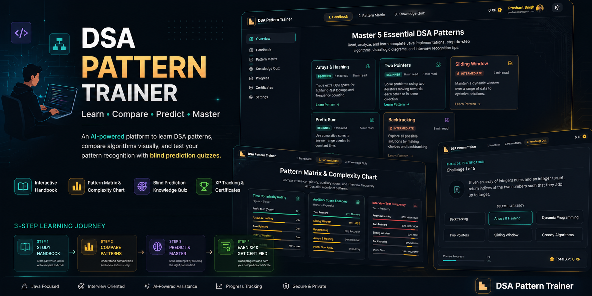
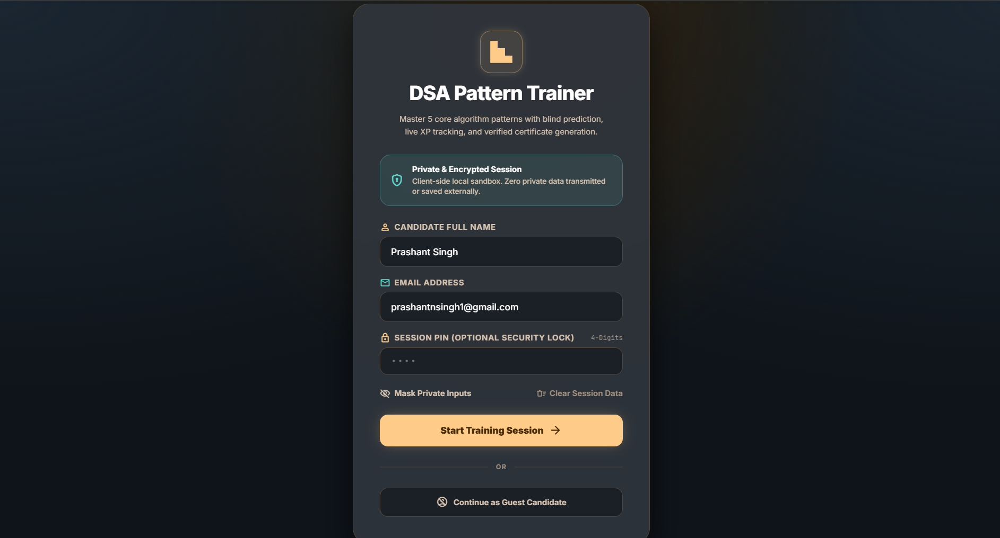
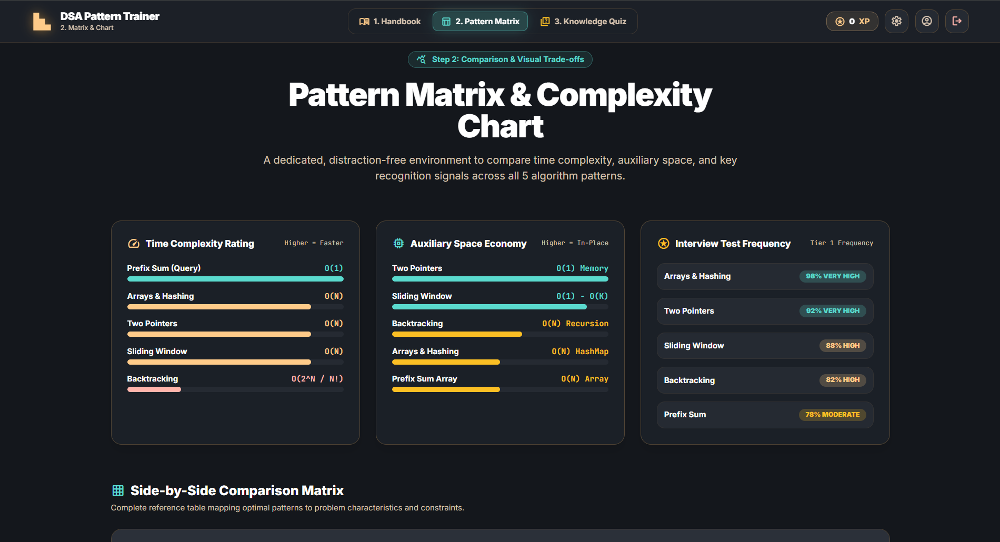
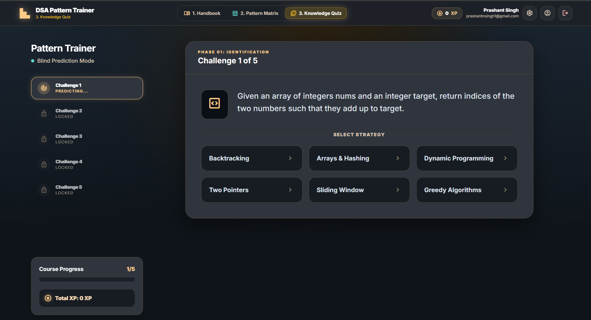
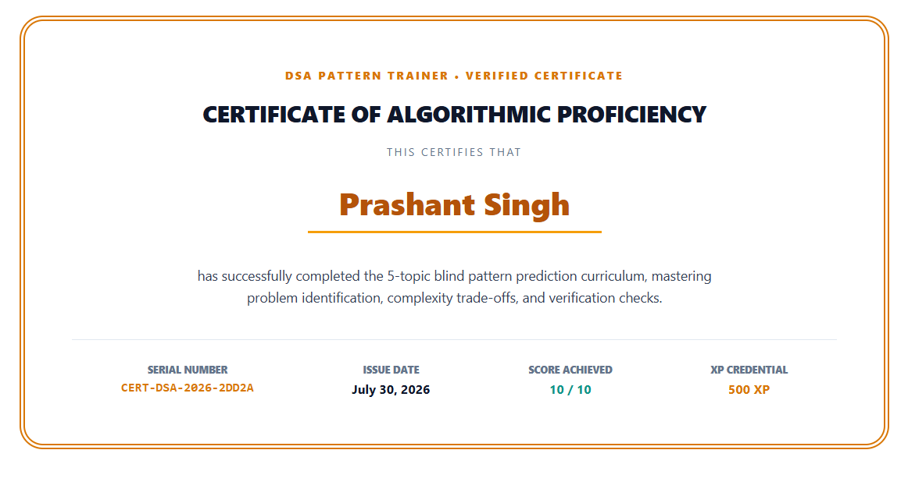

<div align="center">

<p align="center">
  
</p>

# 🚀 DSA Pattern Trainer

### Learn • Compare • Predict • Master Data Structures & Algorithms

<p>
An AI-powered interactive learning platform that helps students master <strong>Data Structures & Algorithms (DSA)</strong> through <strong>pattern recognition</strong> instead of memorizing solutions.
</p>

<p>


</p>

🌐 **Live Demo:** https://dsa-pattern-trainer.ai.studio
🌏 **Using GitHub:** https://prashantvesit.github.io/dsa-pattern-trainer/

</div>

---

# 📖 Overview

DSA Pattern Trainer is an interactive educational platform that teaches learners how to **recognize algorithmic patterns before writing code**.

Instead of memorizing hundreds of coding problems, learners understand

- 📚 Why a pattern works
- 🎯 When to use it
- ⚡ Complexity Trade-offs
- 💻 Java Implementations
- 🧠 Interview Thinking Process

The application follows a structured learning journey that transforms beginners into confident problem solvers.

---

# 🎯 Learning Workflow

```text
                 🔐 Login Session
                        │
                        ▼
         📚 Step 1 — Study Handbook
                        │
                        ▼
      📊 Step 2 — Compare Patterns
                        │
                        ▼
     🧠 Step 3 — Blind Prediction Quiz
                        │
                        ▼
          🏆 Earn XP & Track Progress
                        │
                        ▼
        📜 Generate Certificate
```

---

# ✨ Features

## 📚 Interactive Handbook

Learn five essential DSA patterns through

- Pattern Recognition
- Java Implementations
- Dry Runs
- Complexity Analysis
- Recognition Signals
- Interview Tips
- Common Mistakes
- Best Practices

### Covered Patterns

- Arrays & Hashing
- Two Pointers
- Sliding Window
- Prefix Sum
- Backtracking

---

## 📊 Pattern Matrix

Compare every algorithm visually.

Features

- Time Complexity Comparison
- Space Complexity Comparison
- Interview Frequency
- Recognition Keywords
- Side-by-Side Matrix
- Use Cases

---

## 🧠 Blind Prediction Quiz

Instead of coding immediately, learners first identify

> Which DSA Pattern should solve this problem?

Features

- Blind Prediction
- Progressive Unlocks
- XP Rewards
- Course Progress
- Interview Simulation

---

## 🏆 XP Tracking

- XP System
- Progress Tracking
- Challenge Unlocking
- Performance Summary

---

## 📜 Certificate

Generate a personalized certificate after completing the course.

---

## 🔐 Secure Learning

- Private Session
- Guest Mode
- Optional PIN
- Local Storage
- Client-side Privacy

---

# 📸 Application Preview

## 🔐 Login

Start a secure learning session.

<p align="center">

</p>

---

## 📚 Step 1 — Interactive Handbook

Study five essential DSA patterns with complete Java implementations, complexity analysis and interview tips.

<p align="center">

</p>

---

## 📊 Step 2 — Pattern Matrix

Compare algorithmic patterns visually through complexity charts, interview frequency and side-by-side comparisons.

<p align="center">

</p>

---

## 🧠 Step 3 — Blind Prediction Quiz

Predict the correct algorithmic pattern before writing any code.

<p align="center">

</p>

---

## 📜 Completion Certificate

Generate a personalized certificate after completing the trainer.

<p align="center">

</p>

---

# 🎯 Learning Outcomes

After completing DSA Pattern Trainer, learners will be able to

- Recognize algorithmic patterns instantly
- Choose optimal solutions confidently
- Analyze Time & Space Complexity
- Think like an interviewer
- Improve coding interview performance
- Build stronger problem-solving skills

---

# 🛠 Tech Stack

| Technology | Purpose |
|------------|---------|
| React 19 | Frontend |
| TypeScript | Type Safety |
| Vite | Build Tool |
| Tailwind CSS | Styling |
| Google Gemini AI | AI Assistance |
| Google AI Studio | AI Platform |
| Lucide React | Icons |

---

# 🚀 Installation

Clone the repository

```bash
git clone https://github.com/prashantVESIT/dsa-pattern-trainer.git
```

Move into project

```bash
cd dsa-pattern-trainer
```

Install dependencies

```bash
npm install
```

Create `.env`

```env
GEMINI_API_KEY=YOUR_API_KEY
```

Run

```bash
npm run dev
```

---

# 📂 Repository Structure

```text
dsa-pattern-trainer/
│
├── README.md
├── LICENSE
├── package.json
├── vite.config.ts
├── .gitignore
│
├── screenshots/
│   ├── banner.png
│   ├── Loginpage.png
│   ├── handbook.png
│   ├── PatternMatrix.png
│   ├── KnowledgeQuiz.png
│   └── certificate.png
│
├── src/
├── public/
└── ...
```

---

# 🌟 Future Improvements

- Dynamic Programming
- Graph Algorithms
- Tree Visualizer
- Daily Challenges
- AI Mentor
- Company-wise Questions
- Leaderboards
- Multi-language Support

---

# 🤝 Contributing

Contributions are welcome!

```bash
git checkout -b feature-name
git commit -m "Added new feature"
git push origin feature-name
```

Open a Pull Request.

---

# 📄 License

Licensed under the **MIT License**.

---

<div align="center">

## ⭐ Star this repository if you found it helpful!

Made with ❤️ by **Prashant Singh**

**Learn DSA through Pattern Recognition, Structured Learning & Interview-Oriented Practice**

</div>
